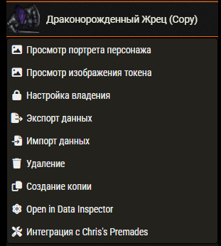
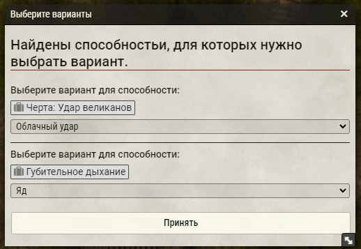
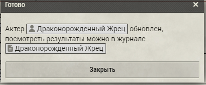
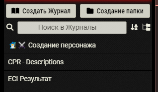
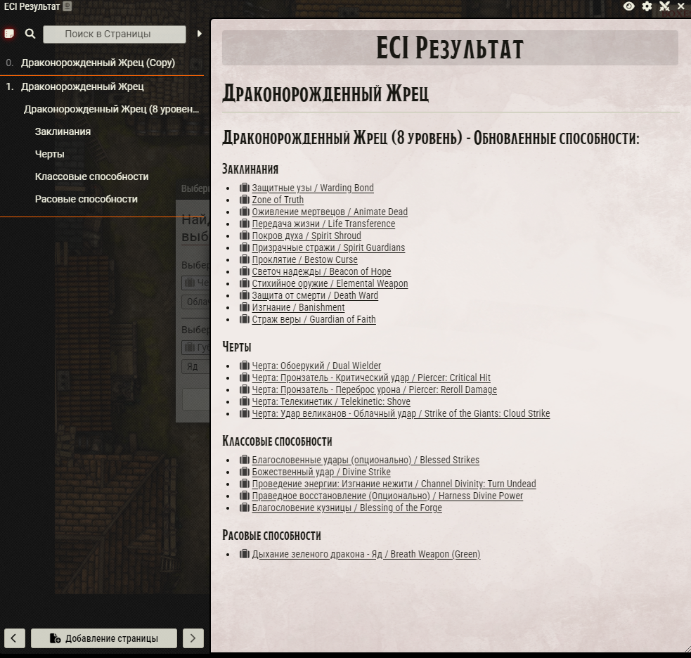
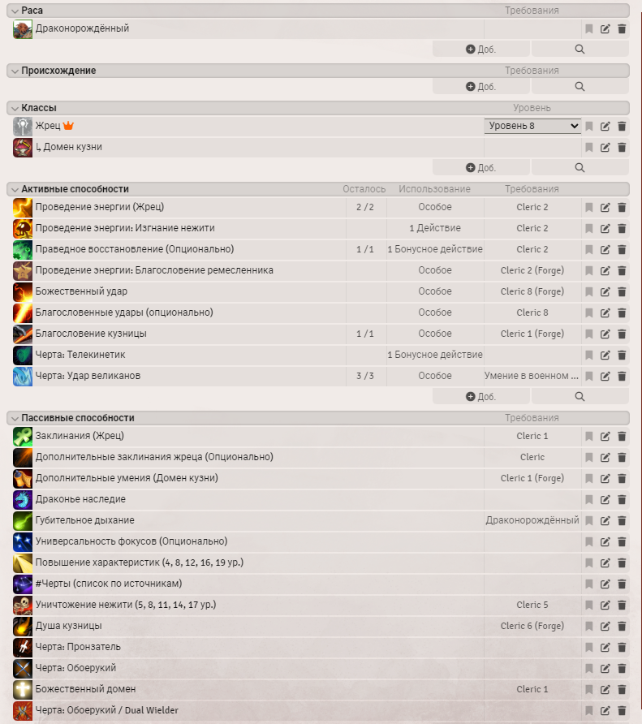
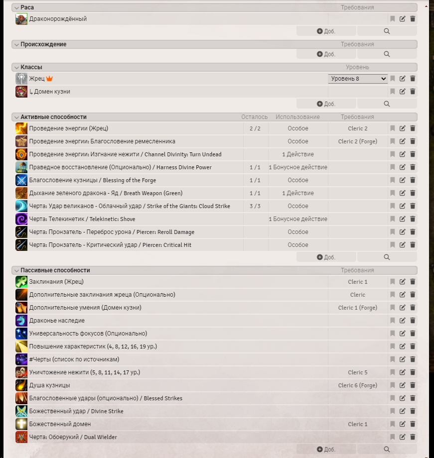

# Интеграция с модулем Chris's Premades
Модуль позволяет быстро применить автоматизации из модуля [Chris's Premades](https://github.com/chrisk123999/chris-premades) к персонажам.
Модуль корректно обрабатывает расовые, классовые способности, черты и заклинания.

# Как пользоваться
## Перед использованием на всякий случай сохраните копию персонажа. Модуль не должен ничего сломать, но лучше иметь бэкап.

1. Нажимаем правой кнопкой на персонажа, к которому хотим применить автоматизацию, и выбираем пункт "Интеграция с Chris's Premades".

2. Ждем, пока модуль обработает персонажа.

3. Если способность требует выбрать один из вариантов, то модуль предложит выбрать один из них.

4. После окончания в журналах появится журнал "ECI Результат" со страницей персонажа и списком обновленных способностей.
   

## В итоге персонаж будет выглядеть примерно так:
### До

### После

### К названиям способностей добавится английское название. Название некоторых способностей может быть изменено на английский вариант, если это необходимо для корректной работы автоматизации.

#### По вопросам и если нашли ошибки, смело пишите в дискорде "elfrey" или на гитхабе.
